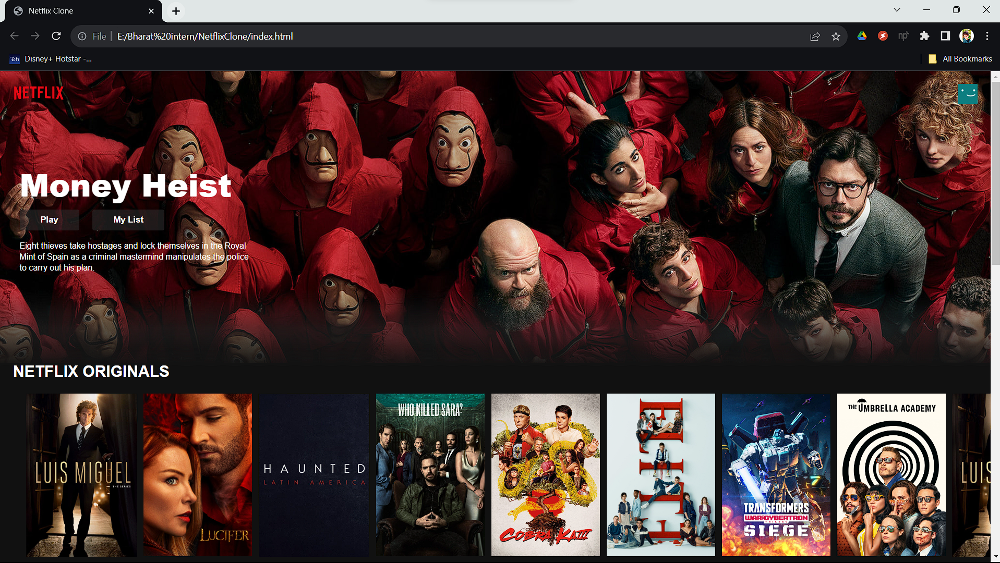

# Netflix-clone
Netflix Clone App: A replica of the Netflix platform showcasing categories and movie posters, enabling users to navigate and click to redirect to specific shows. Built with HTML, CSS, and JavaScript, ready for easy exploration and contributions.
Here, the Link for the Netflix clone hosted on Github: https://sahil9446.github.io/Netflix-clone

Here, the Preview Image of the Netflix clone:

